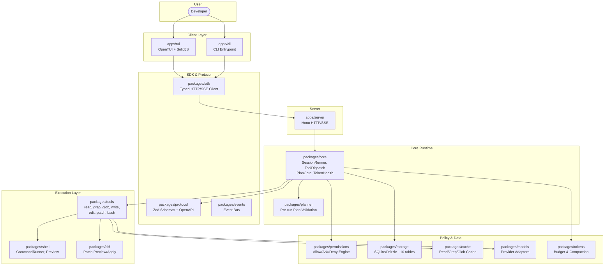
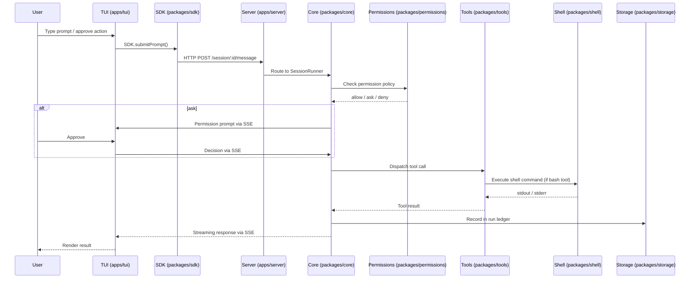

<div align="center">
  <h1>⚡ agent-workbench</h1>
  <p><em>Local-first, OpenCode-style agent TUI workbench for disciplined software development</em></p>

  [](https://github.com/MerverliPy/agent-workbench/actions)
  [](package.json)
  [](tsconfig.base.json)
  [](#)
  [](#)
  [](LICENSE)
  [](CONTRIBUTING.md)
</div>

---

Status: **Phase 17 complete** (CI/CD + E2E validation) → **Phase 18 active** (mobile web companion UI)

---

## 📋 Table of Contents

- [1. What Is This?](#1-what-is-this)
- [2. Quick Start](#2-quick-start)
- [3. Architecture](#3-architecture)
- [4. Package Overview](#4-package-overview)
- [5. Current State](#5-current-state)
- [6. Implementation Status](#6-implementation-status)
- [7. Phase Completion Summary](#7-phase-completion-summary)
- [8. Safety Model](#8-safety-model)
- [9. Next Steps](#9-next-steps)
- [10. Agent Instructions](#10-agent-instructions)
- [11. Verification Commands](#11-verification-commands)

---

## 1. What Is This?

`agent-workbench` is a **local-first agent TUI workbench** for terminal-based software development. It gives developers an interactive coding-agent experience — powered by a local HTTP/SSE server, a typed SDK, a permission-gated runtime, and a thin terminal UI client — all running on your machine with strong safety controls.

**Inspired by** OpenCode-style architecture: a thin terminal UI client talks to a local server, and the server coordinates a core agent runtime that owns sessions, model calls, tools, permissions, storage, and token-health logic.

**Target stack:**

| Layer | Technology |
|-------|-----------|
| Terminal UI | OpenTUI + SolidJS |
| Server | Hono + Zod/OpenAPI |
| Persistence | SQLite + Drizzle |
| Transport | Local HTTP API + SSE event stream |
| Client | Typed SDK |
| Runtime | Custom agent runtime + permission engine + tool runtime |

---

## 2. Quick Start

```bash
# Prerequisites: Bun >= 1.x
curl -fsSL https://bun.sh/install | bash

# Clone & install
git clone https://github.com/MerverliPy/agent-workbench.git
cd agent-workbench
bun install

# Build all workspace packages
bash scripts/build-all.sh

# Run the test suite (357 tests, all passing)
bun test

# Run E2E validation (54 tests)
bun run test:e2e

# Start the server (Terminal 1)
cd apps/server && bun run dev

# Start the TUI (Terminal 2)
cd apps/tui && bun run dev
```

### Per-category test commands

```bash
bun run test:unit          # Unit tests
bun run test:integration   # Integration tests
bun run test:e2e           # End-to-end validation
bash scripts/test-health.sh # Static health checks
bun run test:repeat        # Repeatability (default 3 runs)
```

---

## 3. Architecture



### Request Flow



### Key Architectural Principle

**The TUI is never trusted** to execute privileged operations. It may request actions and render state, but all actual execution must pass through:
1. Server-side validation
2. Core runtime orchestration
3. Permission evaluation
4. Ledger recording

---

## 4. Package Overview

| Package | Status | Phase | Key Exports |
|---------|--------|-------|-------------|
| `@agent-workbench/core` | ✅ Complete | 6–16 | SessionRunner, ContextBuilder, ModelRouter, ToolCallDispatcher, RunLedger, PlanGate, TokenHealthService, AgentRegistry |
| `@agent-workbench/tools` | ✅ Complete | 7–10 | ToolRegistry, read/grep/glob/write/edit/patch/bash tools, path guard, truncation |
| `@agent-workbench/permissions` | ✅ Complete | 8 | PermissionEngine (allow/ask/deny), PermissionGate, defaultPolicy, path/command/agent rules |
| `@agent-workbench/shell` | ✅ Complete | 10 | SimpleCommandRunner, previewCommand, redactSecrets, timeout/abort |
| `@agent-workbench/storage` | ✅ Complete | 5 | SQLite + Drizzle, 10 tables, 9 repositories, migrations |
| `@agent-workbench/protocol` | ✅ Complete | 2 | Zod schemas, route contracts, OpenAPI metadata, error envelopes |
| `@agent-workbench/sdk` | ✅ Complete | 2 | WorkbenchClient, HttpTransport, SseTransport, 14 resource modules |
| `@agent-workbench/models` | ✅ Complete | 15–16 | ModelProvider interface, OpenAI-compatible adapter, StubModelProvider, ProviderRegistry |
| `@agent-workbench/tokens` | ✅ Complete | 12 | Token counting, budget calculation, truncation, compaction |
| `@agent-workbench/diff` | ✅ Complete | 9 | Diff preview, patch apply/revert, file snapshots |
| `@agent-workbench/planner` | ✅ Complete | 13 | Plan validation, risk classification, mutation detection |
| `@agent-workbench/events` | ✅ Complete | 3 | EventBus, EventName definitions |
| `@agent-workbench/cache` | ✅ Complete | 7 | ToolCache for read/grep/glob with invalidation |
| `@agent-workbench/config` | 🚧 Scaffold | 1 | — |
| `@agent-workbench/ui` | 🚧 Scaffold | 1 | — |
| `@agent-workbench/cli` | 🚧 Scaffold | 1 | — |
| **apps/tui** | ✅ Complete | 4, 16 | OpenTUI chat shell, key bindings, streaming |
| **apps/server** | ✅ Complete | 3, 15–17 | Hono app, routes, SSE, CI pipeline |
| **apps/cli** | 🚧 Scaffold | 1 | — |

---

## 5. Current State

**Phases 0–17 are complete.** Phase 18 (mobile web companion UI) adds a lightweight, touch-optimized mobile web app at `apps/mobile-web/` that connects to the same server via the existing SDK — no server or core changes required. See `docs/26_PHASE_18_MOBILE_WEB_UI.md` for the full plan.

Phase 0 planning docs (`docs/00` through `docs/19`) remain the architectural source of truth. Their "Phase 0" status labels refer to planning origin, not current project phase.

---

## 6. Implementation Status

All core systems are implemented:

- ✅ **Terminal UI** (apps/tui) — thin client, rendering only, streaming responses
- ✅ **Local server** (apps/server) — HTTP/SSE control plane, provider routes, CI pipeline
- ✅ **Schema-first protocol** (packages/protocol) — Zod contracts, OpenAPI
- ✅ **Typed SDK** (packages/sdk) — validated client transport, 14 resources
- ✅ **Core runtime** (packages/core) — session runner, tool dispatch, permission orchestration
- ✅ **Storage** (packages/storage) — SQLite/Drizzle, 10 tables, 9 repositories
- ✅ **Read-only tools** (packages/tools) — read, grep, glob
- ✅ **Permission engine** (packages/permissions) — allow/ask/deny, path/command/agent rules
- ✅ **File mutation tools** (packages/tools) — write, edit, apply_patch, diff preview
- ✅ **Shell execution** (packages/shell) — command runner, risk classification, preview
- ✅ **Agent modes** (packages/core) — Build and Plan agents
- ✅ **Token health** (packages/tokens) — budget tracking, compaction support
- ✅ **Pre-run planner** (packages/planner) — mutation plans, plan gate enforcement
- ✅ **Read/search cache** (packages/cache) — invalidation on mutation
- ✅ **Dry-run preview** (packages/diff, packages/shell) — file and command preview
- ✅ **Provider integration** (packages/models) — OpenAI-compatible adapter, registry, config
- ✅ **Streaming responses** — SSE event streaming from provider to TUI
- ✅ **Automated testing** — 357 tests (unit, integration, e2e, fault injection, contract)
- ✅ **CI/CD pipeline** — GitHub Actions with static check + typecheck + tests + E2E
- ⚡ **Mobile web companion** (apps/mobile-web) — in progress, scaffold complete (SolidJS + Tailwind + PWA, 7-panel navigation)

---

## 7. Phase Completion Summary

```text
Phase 0  Planning docs             COMPLETE
Phase 1  Workspace scaffold        COMPLETE
Phase 2  Protocol contract         COMPLETE
Phase 3  Local server              COMPLETE
Phase 4  TUI shell                 COMPLETE
Phase 5  Storage                   COMPLETE
Phase 6  Core runtime              COMPLETE
Phase 7  Read-only tools           COMPLETE
Phase 8  Permission engine         COMPLETE
Phase 9  File mutation tools       COMPLETE
Phase 10 Shell execution           COMPLETE
Phase 11 Agent modes               COMPLETE
Phase 12 Token health              COMPLETE
Phase 13 Pre-run planner           COMPLETE
Phase 14A Automated tests          COMPLETE
Phase 14B Hardening                COMPLETE
Phase 15 Provider integration      COMPLETE
Phase 16 Streaming responses       COMPLETE
Phase 17 CI/CD + E2E validation        COMPLETE
Phase 18 Mobile web companion UI        IN PROGRESS
```

---

## 8. Safety Model

### 8.1 Runtime Safety Guarantees

- 🔒 No shell command bypasses permission checks.
- 🔒 No file mutation bypasses diff preview or plan gate.

### 8.2 Permission Gates

| Operation | Default | Notes |
|-----------|---------|-------|
| Read (read, grep, glob) | `allow` | No approval needed |
| Edit / write / patch | `ask` | Requires user approval |
| Bash / shell commands | `ask` | Requires user approval |
| Destructive operations | `deny` | Blocked unless explicitly configured |

### 8.3 Model-Router Workflow Constraints

- No Copilot model is used as the primary autonomous executor.
- No local-only model is the final authority for high-risk work.
- Secrets and tokens are not stored in plaintext by default.
- The server binds to localhost by default.

### 8.4 Architecture Split

- **TUI** — rendering and user input only. Never spawns processes, executes commands, or evaluates permissions.
- **Server** — thin HTTP/SSE routes. Delegates to core runtime; never executes tools directly.
- **Core runtime** — orchestrates sessions, tool dispatch, permission evaluation, plan gating, and ledger recording.
- **Packages** — tools, permissions, shell, storage, tokens, cache each own a single responsibility.

---

## 9. Next Steps

- **Phase 18** (in progress): Mobile web companion UI at `apps/mobile-web/` — scaffold complete, pending real device testing
- **Phase 19+** (planning): Mobile UX depth (voice input, multiple sessions, light theme), multi-provider support, PTY execution

See `docs/26_PHASE_18_MOBILE_WEB_UI.md` for the full Phase 18 plan and future roadmap.

---

## 10. Agent Instructions

When continuing this project via an AI agent:

1. Treat docs and decisions as the source of truth.
2. Do not re-ask answered architectural questions.
3. Do not invent unresolved details.
4. Mark uncertainty as `Unknown`, `Unresolved`, `Needs confirmation`, or `Provisional`.
5. Preserve the TUI/server/core/storage/permission boundaries.
6. Preserve schema-first API design.
7. Preserve localhost-only server default.
8. Preserve full run ledger requirement.
9. Preserve permission-gated file and shell execution.
10. Provider configuration is environment-sourced. Default tests remain offline with mock providers.

---

## 11. Verification Commands

```bash
# Full test suite
bun test                           # 357 tests, 0 failures, 1072 expect() calls

# Per-category
bun run test:unit                  # Unit tests
bun run test:integration           # Integration tests
bun run test:e2e                   # E2E validation (54 tests)

# Static health checks
bash scripts/test-health.sh

# Repeatability (default 3 runs)
TEST_REPEAT_COUNT=3 bun run test:repeat
```

### Type-check and build (from repo root)

```bash
# Build all packages
bash scripts/build-all.sh

# Individual typechecks
cd packages/protocol && bun run typecheck
cd packages/storage && bun run typecheck
cd packages/core && bun run typecheck
cd packages/sdk && bun run typecheck
cd packages/models && bun run typecheck
cd apps/server && bun run typecheck
cd apps/tui && bun run typecheck
```
