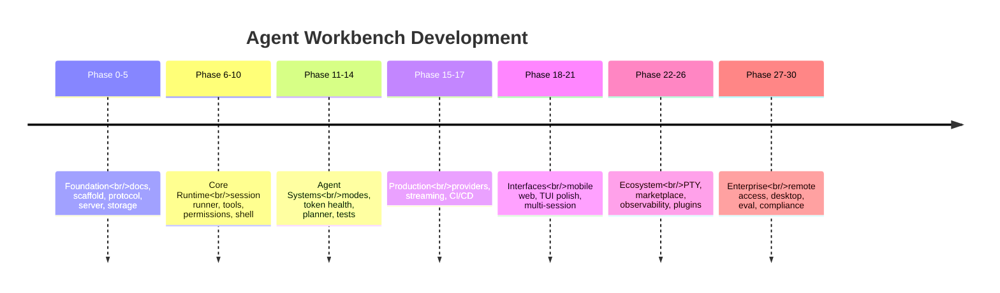
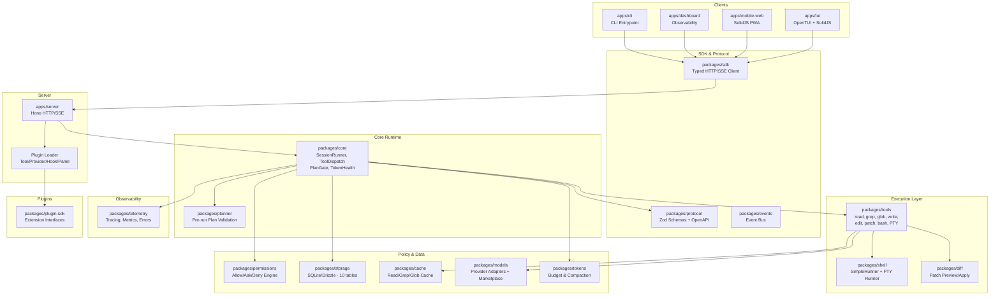

<div align="center">
  <h1>⚡ agent-workbench</h1>
  <p><em>Local-first, OpenCode-style agent TUI workbench for disciplined software development</em></p>

  <p>
    <a href="https://github.com/MerverliPy/agent-workbench/actions"></a>
    <a href="package.json"></a>
    <a href="tsconfig.base.json"></a>
    <a href="biome.json"></a>
    <a href="#"></a>
    <a href="#"></a>
    <a href="LICENSE"></a>
    <a href="CONTRIBUTING.md"></a>
  </p>
</div>

---

> **Status:** Phases 0–26 complete · **523 tests, 0 failures** · Phase 27 (remote access) next

---

## 📋 Table of Contents

- [What Is This?](#what-is-this)
- [Quick Start](#quick-start)
- [Phase Timeline](#phase-timeline)
- [Architecture](#architecture)
- [Package Overview](#package-overview)
- [Implementation Status](#implementation-status)
- [Safety Model](#safety-model)
- [Next Steps](#next-steps)
- [Agent Instructions](#agent-instructions)
- [Verification](#verification)

---

## What Is This?

`agent-workbench` is a **local-first agent TUI workbench** for terminal-based software development. It gives developers an interactive coding-agent experience — powered by a local HTTP/SSE server, a typed SDK, a permission-gated runtime, and a thin terminal UI client — all running on your machine with strong safety controls.

**Inspired by** OpenCode-style architecture: a thin terminal UI client talks to a local server, and the server coordinates a core agent runtime that owns sessions, model calls, tools, permissions, storage, and token-health logic.

### Target Stack

| Layer | Technology |
|-------|-----------|
| Terminal UI | OpenTUI + SolidJS |
| Mobile Web | SolidJS + Tailwind PWA |
| Dashboard | SolidJS + Tailwind (observability) |
| Server | Hono + Zod/OpenAPI |
| Persistence | SQLite + Drizzle |
| Transport | Local HTTP API + SSE event stream |
| Client | Typed SDK |
| Runtime | Custom agent runtime + permission engine + tool runtime |
| Plugins | Plugin SDK with tool/provider/panel/hook extension points |

---

## Quick Start

```bash
# Prerequisites: Bun >= 1.x
curl -fsSL https://bun.sh/install | bash

# Clone & install
git clone https://github.com/MerverliPy/agent-workbench.git
cd agent-workbench
bun install

# Build all workspace packages
bash scripts/build-all.sh

# Run the full test suite (523 tests, all passing)
bun test

# Start the server (Terminal 1)
cd apps/server && WORKBENCH_HOST=0.0.0.0 bun run dev

# Start the TUI (Terminal 2)
cd apps/tui && bun run dev

# Start the mobile web PWA (for phone access)
cd apps/mobile-web && bun run dev

# Start the observability dashboard
cd apps/dashboard && bun run dev
```

---

## Phase Timeline



### Phase Completion

```text
✅ Phase 0  Planning docs              ✅ Phase 10 Shell execution
✅ Phase 1  Workspace scaffold         ✅ Phase 11 Agent modes
✅ Phase 2  Protocol contract          ✅ Phase 12 Token health
✅ Phase 3  Local server               ✅ Phase 13 Pre-run planner
✅ Phase 4  TUI shell                  ✅ Phase 14A Automated tests
✅ Phase 5  Storage                    ✅ Phase 14B Hardening
✅ Phase 6  Core runtime               ✅ Phase 15 Provider integration
✅ Phase 7  Read-only tools            ✅ Phase 16 Streaming responses
✅ Phase 8  Permission engine          ✅ Phase 17 CI/CD + E2E
✅ Phase 9  File mutation tools        ✅ Phase 18 Mobile web companion
                                       ✅ Phase 19 Live provider integration
                                       ✅ Phase 20A Mobile web: non-chat panels
                                       ✅ Phase 20B Mobile web: chat + streaming
                                       ✅ Phase 21 TUI polish & UX
                                       ✅ Phase 22 Multi-session & workspace mgmt
                                       ✅ Phase 23 PTY terminal execution
                                       ✅ Phase 24 Provider marketplace & routing
                                       ✅ Phase 25 Observability & production
                                       ✅ Phase 26 Plugin system & extensibility
                                       ⬜ Phase 27 Remote access & collaboration
```

---

## Architecture



### Key Architectural Principle

**The TUI is never trusted** to execute privileged operations. It may request actions and render state, but all actual execution must pass through:
1. Server-side validation
2. Core runtime orchestration
3. Permission evaluation
4. Ledger recording

---

## Package Overview

| Package | Status | Phase | Key Exports |
|---------|--------|-------|-------------|
| `@agent-workbench/core` | ✅ Complete | 6–16 | SessionRunner, ContextBuilder, ModelRouter, ToolCallDispatcher, PlanGate, TokenHealthService, AgentRegistry |
| `@agent-workbench/tools` | ✅ Complete | 7–10, 23 | ToolRegistry, read/grep/glob/write/edit/patch/bash/pty tools, path guard, truncation |
| `@agent-workbench/permissions` | ✅ Complete | 8 | PermissionEngine (allow/ask/deny), PermissionGate, defaultPolicy, path/command/agent rules |
| `@agent-workbench/shell` | ✅ Complete | 10, 23 | SimpleCommandRunner, PtyCommandRunner, previewCommand, redactSecrets, timeout/abort |
| `@agent-workbench/storage` | ✅ Complete | 5, 22 | SQLite + Drizzle, 10 tables, 11 repositories, migrations, workspace support |
| `@agent-workbench/protocol` | ✅ Complete | 2 | Zod schemas, route contracts, OpenAPI metadata, error envelopes |
| `@agent-workbench/sdk` | ✅ Complete | 2 | WorkbenchClient, HttpTransport, SseTransport, 14 resource modules |
| `@agent-workbench/models` | ✅ Complete | 15–16, 24 | ModelProvider, OpenAI/Anthropic/OpenRouter/Ollama adapters, ProviderRegistry, Marketplace, SmartRouter, CostTracker, HealthMonitor |
| `@agent-workbench/tokens` | ✅ Complete | 12 | Token counting, budget calculation, truncation, compaction |
| `@agent-workbench/diff` | ✅ Complete | 9 | Diff preview, patch apply/revert, file snapshots |
| `@agent-workbench/planner` | ✅ Complete | 13 | Plan validation, risk classification, mutation detection |
| `@agent-workbench/events` | ✅ Complete | 3 | EventBus, EventName definitions |
| `@agent-workbench/cache` | ✅ Complete | 7 | ToolCache for read/grep/glob with invalidation |
| `@agent-workbench/telemetry` | ✅ Complete | 25 | Tracer, MetricsExporter, ErrorReporter, RequestLogger, OpenTelemetry-style spans |
| `@agent-workbench/plugin-sdk` | ✅ Complete | 26 | PluginManifest, ToolPlugin, ProviderPlugin, PanelPlugin, HookPlugin, PluginRegistry, sandbox permissions |
| `@agent-workbench/config` | 🚧 Scaffold | 1 | — |
| `@agent-workbench/ui` | 🚧 Scaffold | 1 | — |
| **apps/tui** | ✅ Complete | 4, 21 | OpenTUI chat shell, key bindings, streaming, command palette |
| **apps/server** | ✅ Complete | 3, 15–26 | Hono app, all routes (sessions, messages, permissions, providers, marketplace, files, git, plugins, observability), SSE, CI pipeline |
| **apps/mobile-web** | ✅ Complete | 18–20 | SolidJS + Tailwind PWA, 7-panel navigation, chat streaming, file browser, git tree, settings, offline support |
| **apps/dashboard** | ✅ Complete | 25 | SolidJS + Tailwind, sessions overview, latency table, cost trends, auto-refresh |
| **apps/cli** | ✅ Complete | 26 | CLI entrypoint: `agent-workbench plugin list|install|enable|disable|uninstall` |

---

## Implementation Status

All core systems are implemented and tested:

- ✅ **Terminal UI** (apps/tui) — thin client, rendering only, streaming responses, key bindings, command palette
- ✅ **Mobile Web PWA** (apps/mobile-web) — 7-panel navigation, SSE streaming, file browser, git tree, offline detection, installable
- ✅ **Dashboard** (apps/dashboard) — sessions overview, latency, cost trends, Prometheus metrics
- ✅ **Local server** (apps/server) — HTTP/SSE control plane, 10+ route groups, CI pipeline
- ✅ **Schema-first protocol** (packages/protocol) — Zod contracts, OpenAPI
- ✅ **Typed SDK** (packages/sdk) — validated client transport, 14 resources
- ✅ **Core runtime** (packages/core) — session runner, tool dispatch, permission orchestration, plan gate
- ✅ **Storage** (packages/storage) — SQLite/Drizzle, 10 tables, 11 repositories, workspace management
- ✅ **Read-only tools** (packages/tools) — read, grep, glob with caching
- ✅ **Permission engine** (packages/permissions) — allow/ask/deny, path/command/agent rules
- ✅ **File mutation tools** (packages/tools) — write, edit, apply_patch, diff preview, revert
- ✅ **Shell execution** (packages/shell) — SimpleCommandRunner + PtyCommandRunner for interactive programs
- ✅ **PTY terminal** (packages/shell) — full pseudo-terminal support for vim, git rebase, REPLs
- ✅ **Agent modes** (packages/core) — Build and Plan agents with mode-specific permissions
- ✅ **Token health** (packages/tokens) — budget tracking, compaction, truncation
- ✅ **Pre-run planner** (packages/planner) — mutation plans, risk classification, plan gate enforcement
- ✅ **Provider integration** (packages/models) — OpenAI, Anthropic, OpenRouter, Ollama adapters
- ✅ **Provider marketplace** (packages/models) — browse, add, remove providers; smart routing; cost tracking
- ✅ **Streaming responses** — SSE event streaming from provider to TUI and mobile-web
- ✅ **Multi-session & workspaces** — side-by-side sessions, workspace management, bulk operations
- ✅ **Observability** (packages/telemetry) — OpenTelemetry tracing, Prometheus metrics, error reporting, audit log
- ✅ **Plugin system** (packages/plugin-sdk) — tool, provider, hook, and panel extension points; CLI management; sandbox permissions
- ✅ **Automated testing** — 523 tests (unit, integration, e2e)
- ✅ **CI/CD pipeline** — GitHub Actions with static check + typecheck + tests + E2E

---

## Safety Model

### Runtime Safety Guarantees

- 🔒 No shell command bypasses permission checks
- 🔒 No file mutation bypasses diff preview or plan gate
- 🔒 Plugins declare permissions; risky permissions are logged and can be gated

### Permission Gates

| Operation | Default | Notes |
|-----------|---------|-------|
| Read (read, grep, glob) | `allow` | No approval needed |
| Edit / write / patch | `ask` | Requires user approval |
| Bash / shell / PTY commands | `ask` | Requires user approval |
| Destructive operations | `deny` | Blocked unless explicitly configured |
| Plugin filesystemWrite | `warn` | Logged; gated in strict mode |

### Model-Router Workflow Constraints

- No Copilot model is used as the primary autonomous executor
- No local-only model is the final authority for high-risk work
- Secrets and tokens are not stored in plaintext by default
- The server binds to localhost by default (override with `WORKBENCH_HOST=0.0.0.0`)

---

## Next Steps

- **Phase 27** (next): Remote access & collaboration — TLS-secured remote access, bearer token auth, session sharing, Tailscale integration
- **Phase 28**: Desktop application (Tauri) — native macOS/Windows/Linux builds, system tray, auto-updates
- **Phase 29**: Model experimentation & evaluation — A/B testing, built-in evals, prompt versioning
- **Phase 30**: Enterprise readiness & compliance — SSO, audit compliance, RBAC, air-gapped mode

See [`docs/27_PROJECT_ROADMAP.md`](docs/27_PROJECT_ROADMAP.md) for the full roadmap.

---

## Agent Instructions

When continuing this project via an AI agent:

1. Treat docs and decisions as the source of truth
2. Do not re-ask answered architectural questions
3. Do not invent unresolved details — mark as `Unknown`, `Unresolved`, `Needs confirmation`, or `Provisional`
4. Preserve the TUI/server/core/storage/permission boundaries
5. Preserve schema-first API design
6. Preserve localhost-only server default
7. Preserve full run ledger requirement
8. Preserve permission-gated file and shell execution
9. Provider configuration is environment-sourced; default tests remain offline with mock providers

---

## Verification

### Quick Commands

```bash
# Full test suite
bun test                           # 523 tests, 0 failures, 1495 expect() calls

# Build everything
bash scripts/build-all.sh

# Auto-rebuild on source changes (development workflow)
bash scripts/build-watch.sh

# Run benchmarks
bun run benchmarks/benchmark-runner.ts

# Per-category
bun test unit                      # Unit tests
bun test integration               # Integration tests
bun test e2e                       # End-to-end tests

# Specific packages
bun test tests/unit/plugin-sdk/    # Plugin system tests (26 tests)
bun test tests/integration/server/ # Server integration tests
```

### Type-check Individual Packages

```bash
cd packages/protocol && bun run typecheck
cd packages/storage && bun run typecheck
cd packages/core && bun run typecheck
cd packages/models && bun run typecheck
cd packages/telemetry && bun run typecheck
cd packages/plugin-sdk && bun run typecheck
cd apps/server && bun run typecheck
cd apps/mobile-web && bun run typecheck
```

### Plugin CLI

```bash
# List installed plugins
agent-workbench plugin list

# Install from local path
agent-workbench plugin install local:~/my-plugin

# Enable / disable
agent-workbench plugin enable my-plugin
agent-workbench plugin disable my-plugin

# Uninstall
agent-workbench plugin uninstall my-plugin
```
