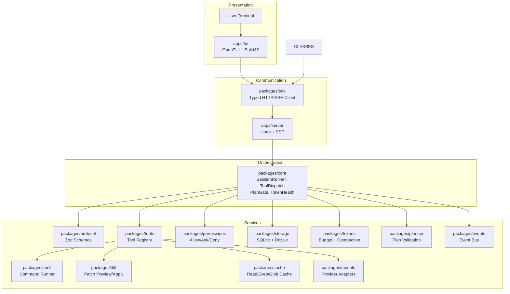

# 02 — Architecture

Status: ⚠️ Historical reference — content superseded by docs/27_PROJECT_ROADMAP.md and live code.  
Document type: agent-ready architecture guide  
Scope: system architecture, package responsibilities, data flows, phase ownership

## 1. Purpose

This document defines the target architecture for `agent-workbench`.

The architecture must keep the TUI, local server, core runtime, tools, permissions, storage, and token-health systems separated by explicit ownership boundaries.

## 2. High-Level Architecture



## 3. Core Architectural Rule

The TUI is a client, not the application authority.

```text
TUI = display + input
Server = API + lifecycle + validation + event transport
Core = agent runtime orchestration
Permissions = action policy
Tools = controlled capabilities
Storage = durable local truth
Events = streaming state
Tokens = context-health control
```

## 4. Target Package Model

Future implementation should use this structure after Phase 0:

```text
apps/
├─ cli/
├─ server/
└─ tui/

packages/
├─ protocol/
├─ sdk/
├─ core/
├─ events/
├─ storage/
├─ config/
├─ permissions/
├─ tools/
├─ models/
├─ shell/
├─ diff/
├─ tokens/
├─ cache/
├─ planner/
└─ ui/
```

Do not create these folders during Phase 0. They are target architecture only until Phase 1.

## 5. Application Layers

### 5.1 CLI Layer

Future folder:

```text
apps/cli
```

Responsibilities:

- Start local server and TUI.
- Start server-only mode.
- Start TUI attach mode.
- Support one-shot run mode later.
- Resolve project root.
- Handle process lifecycle.

Must not own:

- Agent loop.
- Tool execution.
- Permission decisions.
- Database schema.
- TUI component state.

### 5.2 TUI Layer

Future folder:

```text
apps/tui
```

Responsibilities:

- Render terminal UI.
- Capture keyboard input.
- Show messages.
- Show tool calls.
- Show permission prompts.
- Show diffs.
- Show run ledger.
- Show token health.
- Call server through SDK.

Must not own:

- Model calls.
- File mutation.
- Shell execution.
- Permission policy.
- Storage repositories.
- Core runtime.

### 5.3 Server Layer

Future folder:

```text
apps/server
```

Responsibilities:

- Hono app.
- HTTP routes.
- SSE event route.
- Request validation.
- Response envelopes.
- Localhost binding.
- Local auth hook.
- Route-to-core orchestration.

Must not own:

- Core agent reasoning.
- Tool implementation internals.
- Storage schema definitions.
- Terminal rendering.

### 5.4 Protocol Layer

Future folder:

```text
packages/protocol
```

Responsibilities:

- Zod schemas.
- Route contracts.
- Error envelope schemas.
- Event schemas.
- Inferred TypeScript types.
- OpenAPI document inputs.

Must not own:

- Business logic.
- Database queries.
- UI state.
- Tool execution.

### 5.5 SDK Layer

Future folder:

```text
packages/sdk
```

Responsibilities:

- HTTP transport.
- SSE transport.
- Typed resources.
- Client errors.
- TUI-to-server integration.

Must not own:

- Runtime execution.
- Tool logic.
- Permission logic.
- Storage.

### 5.6 Core Runtime Layer

Future folder:

```text
packages/core
```

Responsibilities:

- Session runner.
- Message orchestration.
- Context building.
- Model/tool loop.
- Tool call orchestration.
- Permission engine integration.
- Run cancellation.
- Ledger integration.
- Planning integration.

Must not own:

- TUI rendering.
- HTTP route definitions.
- Database table definitions.
- Provider-specific UI.

### 5.7 Tool Layer

Future folder:

```text
packages/tools
```

Responsibilities:

- Tool definitions.
- Tool input schemas.
- Tool result schemas.
- Tool execution wrappers.
- Read/grep/glob first.
- Later edit/write/apply_patch/bash tools.

Must not own:

- Permission UI.
- Agent session lifecycle.
- TUI rendering.
- API routing.

### 5.8 Permission Layer

Future folder:

```text
packages/permissions
```

Responsibilities:

- `allow`, `ask`, `deny` decisions.
- Tool-level rules.
- Path-level rules.
- Command-level rules.
- Agent-level rules.
- Risk classifiers.
- Permission request construction.

Must not own:

- Modal UI.
- Shell execution.
- File mutation.
- Model calls.

### 5.9 Storage Layer

Future folder:

```text
packages/storage
```

Responsibilities:

- SQLite connection.
- Drizzle schema.
- Repositories.
- Migrations.
- Sessions.
- Messages.
- Tool calls.
- Permissions.
- Run ledger.
- File changes.
- Config snapshots.
- Summaries.
- Cache entries.

Must not own:

- Runtime logic.
- UI formatting.
- Permission policy.
- Tool execution.

### 5.10 Events Layer

Future folder:

```text
packages/events
```

Responsibilities:

- Event bus.
- Event schemas.
- SSE encoding/decoding.
- Event replay buffer.
- Session/message/model/tool/permission/diff/token events.

Must not own:

- HTTP route handlers directly.
- Storage repository implementation.
- Tool execution.

### 5.11 Token-Health Layer

Future folder:

```text
packages/tokens
```

Responsibilities:

- Context budget calculation.
- Tool-result truncation.
- Session summarization.
- Compaction suggestions.
- Relevance ranking.
- Token-health status.

Must not own:

- Model provider secrets.
- TUI rendering.
- Permission decisions.

## 6. Prompt Execution Flow

```text
1. User enters prompt in TUI.
2. TUI sends request through SDK.
3. Server validates request using protocol schemas.
4. Server calls core session runner.
5. Core builds context.
6. Core calls model through model router.
7. Model returns text or tool call.
8. Tool call is validated.
9. Permission engine evaluates tool call.
10. If decision is ask, event is emitted.
11. TUI shows permission prompt.
12. User approves or denies.
13. Tool executes or is blocked.
14. Tool result returns to core.
15. Core continues or completes response.
16. Events stream to TUI.
17. Storage records messages and ledger entries.
```

## 7. File Mutation Flow

```text
1. Agent proposes mutation.
2. Planner verifies mutation is intentional.
3. Permission engine evaluates mutation.
4. Diff package creates patch preview.
5. Server emits diff/permission event.
6. TUI shows preview.
7. User approves or denies.
8. If approved, patch is applied.
9. Storage records file change and ledger event.
10. TUI updates timeline and ledger panel.
```

## 8. Shell Execution Flow

```text
1. Agent proposes command.
2. Command parser normalizes request.
3. Risk classifier categorizes command.
4. Permission engine evaluates command.
5. If ask-gated, TUI shows command approval.
6. Simple command runner executes with timeout.
7. stdout/stderr stream as events.
8. User can abort command.
9. Command result is recorded.
10. Ledger records command metadata and result.
```

## 9. Run Ledger Architecture

Every meaningful action should produce a ledger event.

Required ledger categories:

```text
model_call_started
model_call_completed
tool_call_requested
tool_call_started
tool_call_completed
permission_requested
permission_decided
diff_preview_created
file_mutation_applied
shell_command_requested
shell_command_started
shell_command_completed
shell_command_aborted
token_health_updated
compaction_suggested
compaction_completed
cache_hit
cache_miss
cache_invalidated
```

Exact event names are provisional until `docs/07_API_CONTRACT_PLAN.md`.

## 10. Phase Dependencies

```text
Phase 0 → Docs only
Phase 1 → Uses Phase 0 tree and boundaries
Phase 2 → Defines schemas before routes
Phase 3 → Uses protocol to create server
Phase 4 → Uses SDK/server to create TUI shell
Phase 5 → Adds local storage
Phase 6 → Adds core runtime
Phase 7 → Adds read-only tools
Phase 8 → Adds permission engine
Phase 9 → Adds file mutation
Phase 10 → Adds shell execution
Phase 11 → Adds agents
Phase 12 → Adds token health
```

## 11. Architecture Acceptance Criteria

The architecture is valid when:

```text
[ ] TUI cannot execute tools directly.
[ ] TUI cannot write files directly.
[ ] TUI cannot run shell commands directly.
[ ] Server validates all requests.
[ ] Core owns the agent loop.
[ ] Permission engine evaluates risky actions.
[ ] Storage records sessions and ledger events.
[ ] Token health is a first-class system.
[ ] API schemas are defined before routes.
```

## 12. Hard Constraints

Do not:

- Merge TUI and core runtime.
- Let server route handlers contain model reasoning logic.
- Let tools bypass permissions.
- Let shell bypass command risk classification.
- Let file mutation bypass diff preview.
- Store secrets in plaintext by default.
- Add remote server behavior by default.
- Create implementation folders during Phase 0.

## 13. Open Questions

| ID | Question | Status |
|---|---|---|
| ARCH-001 | Exact event names | Unresolved |
| ARCH-002 | Exact route list and schemas | Deferred to docs/07 |
| ARCH-003 | Exact database fields | Deferred to docs/08 |
| ARCH-004 | Exact Build/Plan prompts | Deferred to docs/09 |
| ARCH-005 | Exact TUI keybindings | Deferred to docs/12 |

## 14. Anti-Patterns

Do not implement:

- A monolithic terminal application.
- An agent loop inside the TUI.
- Permission prompts that are only cosmetic.
- Direct model-to-shell execution.
- Direct model-to-file writes.
- Unlogged risky operations.
- Cache without invalidation.
- Automatic compaction without user visibility.

## 15. Agent Instructions

Future coding agents must:

1. Read this file before creating folders.
2. Preserve package boundaries.
3. Implement schemas before handlers.
4. Implement permissions before mutation tools.
5. Implement simple shell before PTY.
6. Emit events for observable runtime changes.
7. Record ledger entries for risky operations.
8. Mark unresolved architecture details instead of inventing them.

## 16. Validation Checklist

```text
[ ] Architecture layers are clear.
[ ] Package responsibilities are documented.
[ ] Forbidden ownership overlaps are documented.
[ ] Core flows are documented.
[ ] Risky operations require permissions and ledger records.
[ ] Open questions are explicitly marked.
```
