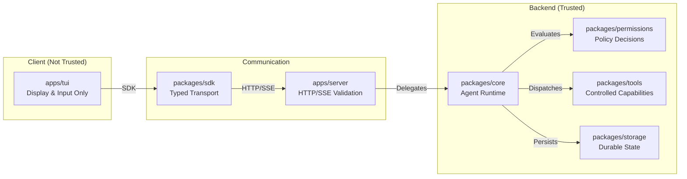

# 03 — Backend / Frontend Boundary

Status: Phase 0 — Planning Docs  
Document type: agent-ready boundary contract  
Scope: TUI, SDK, server, core, permissions, storage, events

## 1. Purpose

This document defines the boundary between the frontend terminal UI and the backend runtime layers.

The most important rule:

```text
The TUI is a client. It is not trusted to execute, authorize, mutate, or persist privileged state.
```

## 2. Boundary Summary



## 3. TUI Responsibilities

The TUI may:

- Render message timeline.
- Render assistant output.
- Render tool call cards.
- Render permission modals.
- Render diff previews.
- Render run ledger panel.
- Render token-health panel.
- Accept user prompt input.
- Accept command palette input.
- Send requests to server through SDK.
- Subscribe to SSE events.
- Maintain ephemeral UI state.

The TUI may not:

- Execute tools.
- Edit files.
- Write files.
- Apply patches.
- Run shell commands.
- Call model providers directly.
- Evaluate permission policy.
- Persist source-of-truth session state.
- Modify SQLite storage directly.
- Override backend decisions.
- Bypass server validation.

## 4. Server Responsibilities

The server may:

- Bind to localhost.
- Expose HTTP routes.
- Expose SSE event stream.
- Validate requests using protocol schemas.
- Map route requests to core services.
- Apply middleware.
- Return error envelopes.
- Coordinate local auth.
- Manage server lifecycle.
- Emit events to connected clients.

The server may not:

- Render TUI components.
- Own the agent reasoning loop.
- Define database schema.
- Implement provider-specific model behavior inside route handlers.
- Execute shell commands without core/tool/permission path.
- Apply file mutations directly from route handlers.

## 5. Core Runtime Responsibilities

The core runtime may:

- Run sessions.
- Build context.
- Call model router.
- Parse model outputs.
- Orchestrate tool calls.
- Request permission decisions.
- Publish runtime events.
- Write run ledger entries through storage.
- Abort/cancel active runs.
- Integrate planner, cache, and token-health systems.

The core runtime may not:

- Render UI.
- Assume terminal-specific behavior.
- Expose HTTP directly.
- Store secrets directly.
- Bypass permission engine.

## 6. SDK Responsibilities

The SDK may:

- Provide typed resources for server routes.
- Send HTTP requests.
- Subscribe to SSE.
- Normalize transport errors.
- Provide methods for sessions, messages, events, config, permissions, tools, and files.

The SDK may not:

- Implement business logic.
- Execute tools.
- Mutate local files.
- Decide permissions.
- Own server lifecycle.

## 7. Storage Responsibilities

Storage may:

- Persist sessions.
- Persist messages.
- Persist tool calls.
- Persist permission requests and decisions.
- Persist file change records.
- Persist run ledger events.
- Persist summaries.
- Persist cache entries.
- Persist config snapshots.

Storage may not:

- Decide whether an action is allowed.
- Execute tools.
- Render UI.
- Call models.
- Run shell commands.

## 8. Import Boundary Rules

### Allowed TUI Imports

Future `apps/tui` may import:

```text
packages/sdk
packages/protocol
packages/events
packages/ui
```

### Forbidden TUI Imports

Future `apps/tui` must not import:

```text
packages/core/internal
packages/tools
packages/shell
packages/storage
packages/permissions/internal
packages/models/internal
packages/diff/internal mutation executors
```

### Server Imports

Future `apps/server` may import:

```text
packages/protocol
packages/core
packages/events
packages/config
packages/sdk types if needed
```

Future `apps/server` should avoid importing low-level tool executors directly unless the call goes through core-approved orchestration.

### Core Imports

Future `packages/core` may import:

```text
packages/models
packages/tools
packages/permissions
packages/events
packages/storage repositories
packages/config
packages/tokens
packages/cache
packages/planner
packages/diff
```

Core must use stable package APIs, not internal file paths.

## 9. Request Boundary

All user-initiated work must follow this path:

```text
TUI → SDK → Server route → Protocol validation → Core runtime → Permission/tools/storage/events
```

Do not allow:

```text
TUI → tools
TUI → shell
TUI → storage
TUI → model provider
TUI → filesystem mutation
```

## 10. Permission Boundary

Permissions must be evaluated server/core-side.

The TUI can display:

```text
permission request
risk summary
command preview
file preview
approval buttons
deny buttons
```

The TUI cannot compute:

```text
allow
ask
deny
risk level
policy match
path authorization
command authorization
```

The authoritative decision must come from `packages/permissions`.

## 11. File Mutation Boundary

File mutation must follow:

```text
core request
  ↓
planner/mutation gate
  ↓
permission engine
  ↓
diff preview
  ↓
user approval if required
  ↓
patch apply
  ↓
storage ledger
  ↓
events to TUI
```

Do not allow:

```text
TUI applies patch
TUI writes file
server route writes file directly
model output writes file directly
```

## 12. Shell Boundary

Shell execution must follow:

```text
core request
  ↓
command parser
  ↓
risk classifier
  ↓
permission engine
  ↓
simple command runner
  ↓
stdout/stderr events
  ↓
ledger record
```

Do not allow:

```text
TUI spawns process
server route spawns process directly
model calls shell directly
permission prompt skipped for bash
```

## 13. Event Boundary

Events are runtime observations, not authority.

The TUI uses events to update display state. It must not infer permission state or mutate backend state from events alone.

Examples:

```text
message.delta
tool.requested
permission.requested
permission.decided
diff.preview_created
shell.output
token_health.updated
```

Exact event names are unresolved.

## 14. Acceptance Criteria

The boundary is correctly implemented when:

```text
[ ] TUI can be replaced by another client.
[ ] Server can run headlessly.
[ ] Core can run without terminal UI assumptions.
[ ] Tools cannot run without core orchestration.
[ ] Risky tools cannot bypass permission engine.
[ ] Storage is not directly accessed by TUI.
[ ] Permission state is authoritative in backend, not frontend.
```

## 15. Anti-Patterns

Do not:

- Put tool logic in UI components.
- Put model provider logic in route handlers.
- Let the TUI decide if an operation is safe.
- Let command palette commands execute local shell directly.
- Treat UI state as durable session truth.
- Write files from frontend code.
- Skip SDK and call random endpoints manually from TUI components.

## 16. Agent Instructions

When implementing:

1. Start with protocol contracts.
2. Generate or expose typed SDK methods.
3. Make the TUI call SDK methods only.
4. Validate server requests.
5. Route execution through core.
6. Route risky execution through permissions.
7. Record ledger entries.
8. Emit events back to TUI.

## 17. Boundary Validation Checklist

```text
[ ] No forbidden TUI imports.
[ ] No direct shell execution in TUI.
[ ] No direct file writes in TUI.
[ ] No direct storage access in TUI.
[ ] No direct model calls in TUI.
[ ] All requests use SDK/protocol route.
[ ] All risky operations use permission engine.
[ ] All risky operations write ledger entries.
```

## 18. Open Questions

| ID | Question | Status |
|---|---|---|
| BND-001 | Exact import-boundary enforcement tool | Unresolved |
| BND-002 | Exact SDK generation approach | Unresolved |
| BND-003 | Exact route naming | Deferred to API contract plan |
| BND-004 | Exact event naming | Deferred to API contract plan |
