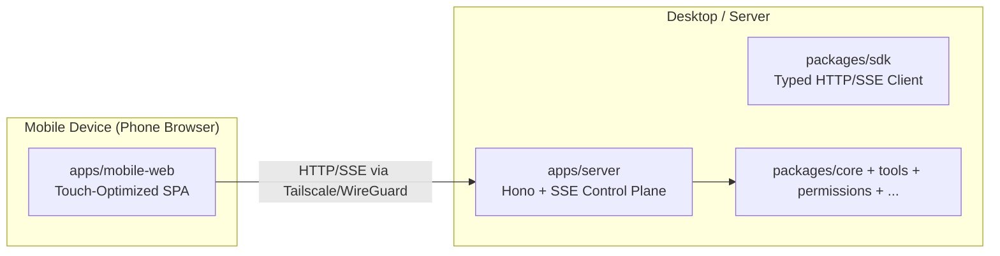
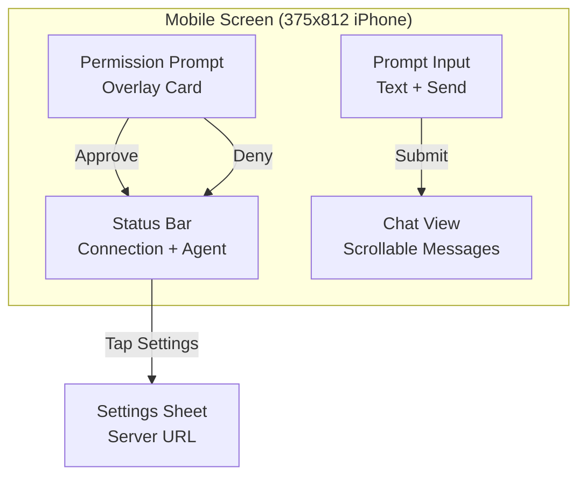
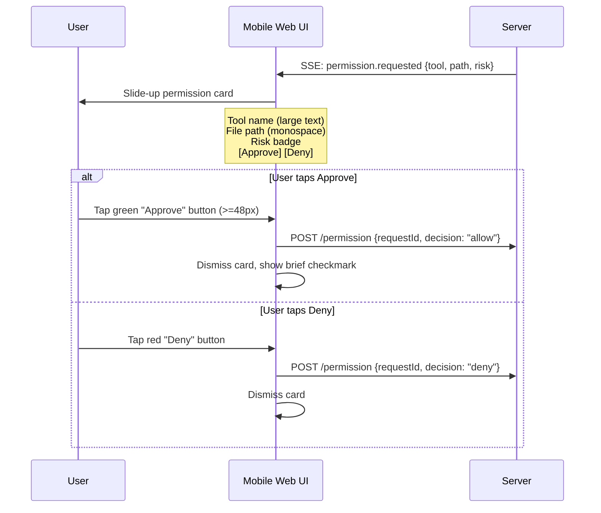

# 26 — Phase 18 Mobile Web Companion UI

Status: Draft — not yet accepted
Document type: implementation plan + future roadmap
Scope: lightweight mobile web companion app connecting to the agent-workbench server via the existing SDK

---

## 1. Summary

The existing TUI (`apps/tui`) is a terminal-native OpenTUI + SolidJS app. It works on desktop terminals but is **not usable on mobile devices** — it renders in a terminal emulator and expects keyboard input. This phase adds a **mobile web companion UI** (`apps/mobile-web`) that connects to the same agent-workbench server via the existing `@agent-workbench/sdk` but renders as a lightweight, touch-optimized web app in a phone browser.

This phase changes **zero server or core packages**. The SDK already supports all the operations the mobile web needs: health checks, session management, message submission, SSE event streaming, permission responses, and provider queries. The mobile web is a new client — same protocol, new presentation layer.



### Why a Web App, Not a Native App

| Option | Effort | User Experience |
|--------|--------|----------------|
| Mobile web SPA (this phase) | ~2 weeks | Good — PWA-cacheable, zero install |
| React Native / Expo app | ~4 weeks | Better push notifications, but overkill |
| Termius / SSH to TUI | Already works | Poor — terminal UI not touch-optimized |

A mobile web SPA is the fastest path to a usable mobile experience.

### Why Not Modify the Existing TUI

The existing TUI uses OpenTUI, a terminal rendering framework. It cannot render in a browser. Rewriting it as a dual terminal/web app would require a complete re-architecture. A separate mobile web companion is cleaner and preserves the existing TUI untouched.

---

## 2. Design

### 2.1 Technology Choice

| Layer | Choice | Rationale |
|-------|--------|-----------|
| Framework | **SolidJS** (same as desktop TUI) | Team familiarity, same reactive model, small bundle |
| Build | **Vite** | Fast HMR, easy PWA config |
| Styling | **Tailwind CSS v4** | Rapid mobile-first prototyping, small output |
| Transport | **`@agent-workbench/sdk`** (existing) | Zero server changes, typed client |
| Icons | **Lucide** | Well-known, tree-shakeable icon set |
| PWA | **vite-plugin-pwa** | Offline-capable, add-to-home-screen |

Bundle target: browsers with ES module support (Safari 16+, Chrome 90+).

### 2.2 Connection Model

The critical design constraint: the server binds to `localhost:3000` by default. On mobile, the browser cannot reach `localhost`. There are three connection patterns:

| Pattern | Setup | Latency |
|---------|-------|---------|
| **Tailscale** (recommended) | Install Tailscale on both devices. Connect via `http://100.x.x.x:3000` | ~5ms LAN or ~20ms over Tailscale relay |
| **LAN IP** (simplest) | Start server with `HOST=0.0.0.0`. Connect via `http://192.168.x.x:3000` | ~2ms LAN |
| **Tunnel** (ngrok, bore) | Run `ngrok http 3000`. Connect via HTTPS URL | ~50ms+ internet latency |

The mobile web UI must support **configurable `baseUrl`** in its settings so users can enter their server's address.

```typescript
// Connection settings stored in localStorage
interface ConnectionSettings {
  serverUrl: string;       // e.g. "http://192.168.1.50:3000"
  autoConnect: boolean;
  reconnectIntervalMs: number;  // default 5000
}
```

### 2.3 What the Mobile Web Renders

**Core features (Phase 18 scope):**

| Feature | Implementation |
|---------|---------------|
| **Chat view** | Scrollable message timeline (user + assistant + system messages). Auto-scroll on new content. Streaming text rendered incrementally. |
| **Prompt input** | Text input with send button. Multi-line via long-press return key. Submit on tap send icon. |
| **Permission prompts** | Full-width "Approve / Deny" card when server sends `permission.requested`. Shows tool name, path, risk level. Thumb-friendly buttons (min 48px tap target). |
| **Connection status** | Indicator showing connected/disconnected/reconnecting state. Tap to reveal settings or retry. |
| **Server settings** | Configurable `baseUrl`. Stored in localStorage. Test connection button. |
| **Agent indicator** | Shows current agent mode. Tap to switch between Build / Plan. |
| **Streaming indicator** | Pulsing dot while model response is streaming in. |

**Not in scope (deferred):**
- Diff viewer / file tree
- Token health panel
- Run ledger panel
- Command palette
- Multiple sessions
- Agent logs / debug output
- Push notifications

### 2.4 Screen Layout



The layout is a single column, full viewport height:
1. **Status bar** (40px) — connection dot + agent badge. Tap opens settings.
2. **Chat view** (flex-grow) — scrollable, pull-to-refresh.
3. **Prompt input** (auto-height) — textarea + send button, sticks to bottom.
4. **Permission overlay** (modal card) — slides up from bottom when permission requested.

### 2.5 Event Routing (Replicated from Desktop TUI)

The mobile web subscribes to the same SSE event stream as the desktop TUI, using the same `sdk.events` resource. The event handler mirrors the patterns in `apps/tui/src/App.tsx`:

| SSE Event | Mobile UI Action |
|-----------|-----------------|
| `message.created` / `message.delta` | Append message to chat view |
| `permission.requested` | Show permission prompt overlay |
| `permission.decided` | Dismiss permission prompt |
| `model.stream_delta` | Append content to in-progress message |
| `model.stream_complete` | Finalize message, remove streaming indicator |
| `model.stream_error` | Show error toast |
| `agent.selected` | Update agent badge in status bar |
| `shell.*` | Show compact shell status indicator |

### 2.6 Permission Flow on Mobile

The most critical mobile UX challenge is permission approval. The desktop TUI uses keyboard shortcuts (Enter/Control keys). Mobile must use touch:



### 2.7 Streaming Response Rendering

When the server emits `model.stream_delta` events, the mobile web must render incremental text in the chat view without jank:

- Pre-allocate a message slot on the first delta
- Append text content reactively (SolidJS already handles this well)
- Show a subtle pulsing dot indicator at the end of the streaming message
- On `model.stream_complete`, finalize the message and remove the indicator
- On error, append error notice and cancel streaming

---

## 3. File Structure

```
apps/mobile-web/
├── index.html                    # SPA entry, meta viewport, theme-color
├── package.json                  # Depends on @agent-workbench/sdk + solid-js + tailwindcss
├── vite.config.ts                # Vite + PWA plugin config
├── tsconfig.json                 # Strict TS config
├── tailwind.config.ts            # Mobile-first breakpoints, custom colors
├── postcss.config.js             # Tailwind + autoprefixer
├── public/
│   ├── manifest.json             # PWA manifest (name, icons, theme-color)
│   └── icons/                    # PWA icons (192x192, 512x512)
└── src/
    ├── index.tsx                  # Mount App to #root
    ├── App.tsx                    # Root: connection check → chat view or settings
    ├── lib/
    │   ├── sdk.ts                 # WorkbenchClient singleton + baseUrl config
    │   ├── settings.ts            # Connection settings persisted in localStorage
    │   └── events.ts              # SSE event handler (mirrors App.tsx pattern)
    ├── state/
    │   └── app.ts                 # SolidJS signals: messages, connection, permissions, streaming
    ├── components/
    │   ├── StatusBar.tsx           # Connection dot + agent badge
    │   ├── ChatView.tsx            # Scrollable message list
    │   ├── MessageBubble.tsx       # Single message (user/assistant/system with styling)
    │   ├── StreamingIndicator.tsx  # Pulsing dot during active streaming
    │   ├── PromptInput.tsx         # Textarea + send button
    │   ├── PermissionPrompt.tsx    # Swipe-up permission card
    │   ├── ConnectionSettings.tsx  # Server URL config sheet
    │   └── AgentSelector.tsx       # Build/Plan toggle
    └── styles/
        └── index.css               # Tailwind directives + custom mobile styles
```

---

## 4. Packages Changed

| Package | Change |
|---------|--------|
| `apps/mobile-web` | **Create** — entire new app |
| `packages/sdk` | **No changes needed** — all required operations already supported |

No server, core, or other packages are touched.

---

## 5. Implementation Order

### Task 1: Scaffold the mobile web app

- Create `apps/mobile-web/` directory structure
- Set up Vite + SolidJS + Tailwind + PWA
- Create `index.html` with mobile viewport meta
- Verify dev server runs at `bun run dev`

### Task 2: SDK integration layer

- Create `src/lib/sdk.ts` — `WorkbenchClient` singleton with configurable `baseUrl`
- Create `src/lib/settings.ts` — localStorage persistence for connection settings
- Create `src/lib/events.ts` — SSE event handler routing events to SolidJS signals

### Task 3: State management

- Create `src/state/app.ts` — all SolidJS signals:
  - `connectionStatus`: "disconnected" | "connecting" | "connected" | "error"
  - `serverUrl`: string
  - `messages`: DisplayMessage[]
  - `streamingMessageId`: string | null
  - `pendingPermissionRequest`: PermissionRequest | null
  - `currentAgentId`: string
  - `availableAgents`: AgentListItem[]

### Task 4: Core UI components (chat)

- `StatusBar.tsx` — connection indicator dot + agent badge. Tap opens settings.
- `ChatView.tsx` — scrollable message list, auto-scroll on new content
- `MessageBubble.tsx` — role-based styling (user right-aligned, assistant left, system centered)
- `StreamingIndicator.tsx` — pulsing dot at end of streaming message
- `PromptInput.tsx` — textarea + send icon button, auto-resize

### Task 5: Permission prompt

- `PermissionPrompt.tsx` — modal card sliding up from bottom
- Shows tool name (large), file path (monospace), risk level badge
- Two thumb-friendly buttons: green Approve + red Deny
- Sends `POST /permission` with the decision via SDK

### Task 6: Settings & agent selector

- `ConnectionSettings.tsx` — URL input, "Test Connection" button, save/reset
- `AgentSelector.tsx` — Build / Plan toggle, calls `sdk.sessions.update()`

### Task 7: Root App component

- `App.tsx` — lifecycle: health check → SSE subscription → message submission
- Wire all components together
- Handle error states: server unreachable, connection lost, stream failures

### Task 8: PWA configuration

- `manifest.json` — app name, icons, theme-color (`#0f172a` dark slate)
- Register service worker for offline fallback page
- Test "Add to Home Screen" on iOS Safari and Android Chrome

### Task 9: Mobile-specific polish

- Pull-to-refresh for chat view (reconnect check)
- Swipe to dismiss permission prompt
- Haptic feedback simulation (CSS `:active` scale transforms)
- Keyboard avoidance when prompt input is focused
- Safe area insets for notch phones (iOS `env(safe-area-inset-*)`)

### Task 10: Testing

- Manual verification on:
  - iPhone SE / 14 Pro / 15 (Safari)
  - Pixel 7 / Samsung S23 (Chrome)
  - iPad / tablet (landscape and portrait)
- Verify all SSE event types render correctly
- Verify permission flow end-to-end
- Verify streaming rendering
- Verify reconnection after server restart

---

## 6. Non-Goals (Deferred)

These are explicitly **not** part of Phase 18:

| Feature | Rationale | Future Phase |
|---------|-----------|-------------|
| Native push notifications | Requires native app or push service | Phase 19+ |
| Full agent runtime controls (plan approve, compaction, etc.) | Too complex for v1 mobile | Phase 20+ |
| Multiple session management | Chat-only single session for v1 | Phase 19+ |
| Offline message queue | Complex conflict resolution | Phase 21+ |
| Biometric auth for sensitive operations | Native SDK requirement | Phase 22+ |
| Voice input | Additional API surface | Phase 19+ |
| File preview / inline diff | Screen real estate constraint | Phase 19+ |
| Dark/light theme toggle | Start dark-only, add light later | Phase 19+ |
| i18n / localization | English-only for v1 | Phase 21+ |

---

## 7. Future Update Roadmap

This section defines the evolution of the mobile web UI across future phases after the initial Phase 18 release.

### Phase 19 — Mobile UX Depth

| Feature | Detail |
|---------|--------|
| **Multiple sessions** | Session list, session switching, session creation |
| **Agent logs** | Collapsible log section showing tool calls and decisions |
| **Voice input** | Web Speech API — speech-to-text for prompt input |
| **Light theme** | Theme toggle with persisted preference |
| **Inline diff view** | Simplified diff rendering (add/remove lines) for mobile |
| **Connection presets** | Save multiple server URLs with labels |

### Phase 20 — Agent Interaction Depth

| Feature | Detail |
|---------|--------|
| **Plan approval** | View plan summary, approve/deny with reason |
| **Compaction control** | Accept/reject compaction suggestions |
| **Token health gauge** | Compact visualization (progress ring) |
| **Shell output viewer** | Tap to expand shell command output |
| **Command palette (mobile)** | Sliding bottom sheet with quick actions |

### Phase 21 — Reliability & Offline

| Feature | Detail |
|---------|--------|
| **Offline message queue** | Queue prompts when disconnected, send on reconnect |
| **Push notifications** | Requires native wrapper (Capacitor / PWA push) |
| **Auto-reconnect with backoff** | Exponential backoff, tap to retry immediately |
| **Connection health monitoring** | Latency tracking, reconnect suggestions |
| **i18n** | English + 1 additional language per release |

### Phase 22 — Native Experience

| Feature | Detail |
|---------|--------|
| **Capacitor wrapper** | Wrap SPA as iOS + Android app for App Store / Play Store |
| **Biometric unlock** | Face ID / fingerprint for sensitive operations |
| **Background SSE** | Keep stream alive when app is backgrounded |
| **Share sheet** | Share permission requests, sessions, logs |
| **Widget** | Home screen widget showing connection status |

### Phase 23 — Advanced Mobile

| Feature | Detail |
|---------|--------|
| **Multi-user / team mode** | Connect to shared server from multiple devices |
| **Session sharing** | Share live session view as read-only link |
| **Notifications for approvals** | Push notification when server asks for permission |
| **Voice mode** | Real-time voice conversation with agent |
| **Apple Watch / Wear OS companion** | Quick approve/deny from wrist |

---

## 8. Risks, Tradeoffs, and Open Questions

| Risk | Likelihood | Mitigation |
|------|-----------|-----------|
| Mobile browser kills SSE on background | High | Use `Page Visibility API` to reconnect on focus. Show reconnection indicator. |
| Tailscale connection is non-obvious | Medium | Provide in-app setup guide with QR code for Tailscale IP. |
| Permission approve/deny mis-taps | Medium | Confirmation step for destructive permissions. Haptic feedback. |
| Long message content breaks layout | Low | CSS word-break + max-height with scroll. |
| CORS issues on mobile browser | Low | Server already uses Hono — configure CORS middleware for mobile-web origin. |

### Open Questions

- `Provisional` — Should the mobile web use React instead of SolidJS for broader ecosystem? **Decision: SolidJS** — matches existing TUI, smaller bundle, team familiarity.
- `Provisional` — Should connection settings support QR code scanning for Tailscale IP? **Defer** — manual entry for v1.
- `Unresolved` — Should the mobile web support landscape orientation or be portrait-only? **Portrait-optimized** for v1, responsive to both.
- `Unresolved` — Should we publish to iOS TestFlight for testing? **Defer** — web URL is sufficient for v1 testing.

---

## 9. Verification

```text
bun install                   # Installs new mobile-web deps
bun run build                 # Builds mobile-web alongside existing packages
# Manual testing on:
#   - iPhone (Safari): connect to server via Tailscale IP
#   - Android (Chrome): connect to server via LAN IP
#   - Desktop browser (Chrome DevTools mobile emulation)
Checklist:
  [ ] Chat view renders messages correctly
  [ ] Streaming text renders incrementally
  [ ] Permission prompt shows and approves/denies
  [ ] Connection settings saves and restores
  [ ] Agent mode toggles correctly
  [ ] Reconnection works after server restart
  [ ] PWA manifest loads, "Add to Home Screen" works
```

---

## 10. Phase 18 Exit Gate

Phase 18 is complete when:

- [ ] Mobile web app scaffold exists at `apps/mobile-web/`
- [ ] User can connect to a running server from a phone browser
- [ ] Chat messages render from SSE events
- [ ] Streaming model responses render incrementally
- [ ] Permission prompts display and respond to approve/deny
- [ ] Connection settings persist across page refreshes
- [ ] PWA manifest enables "Add to Home Screen"
- [ ] All desktop TUI tests still pass (zero regressions)
- [ ] README at `apps/mobile-web/README.md` documents setup and connection
