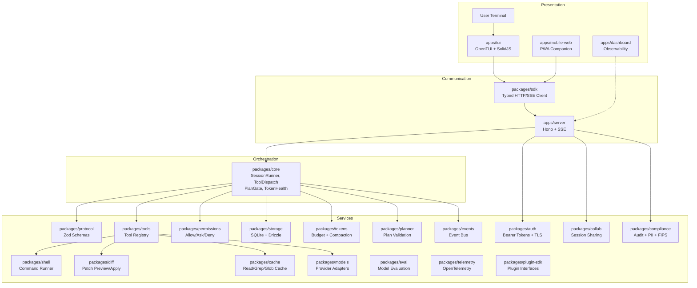

# 02 — Architecture

Status: Phase 30 complete — see AGENTS.md for authoritative package boundaries  
Document type: agent-ready architecture guide  
Scope: system architecture, package responsibilities, data flows, phase ownership

## 1. Purpose

This document defines the architecture for `agent-workbench`.

The architecture keeps the TUI, local server, core runtime, tools, permissions, storage, and token-health systems separated by explicit ownership boundaries. All 30 phases are complete as of July 2026.

**AGENTS.md** is the canonical source of truth for package boundaries and allowed imports. This doc provides the architectural narrative and data flows.

## 2. High-Level Architecture



## 3. Core Architectural Rule

The TUI is a client, not the application authority.

```text
TUI = display + input
Server = API + lifecycle + validation + event transport
Core = agent runtime orchestration
Permissions = action policy
Tools = controlled capabilities
Storage = durable local truth
Events = streaming state
Tokens = context-health control
Compliance = audit trail, PII scanning, data retention
```

## 4. Target Package Model

```text
apps/
├─ cli/              CLI entrypoint, plugin management, project scaffolding
├─ dashboard/        Observability dashboard (SolidJS — standalone for now)
├─ mobile-web/       PWA companion (SolidJS + Tailwind, connects via SDK)
├─ server/           Hono HTTP/SSE control plane
└─ tui/              Terminal UI (OpenTUI + SolidJS, connects via SDK)

packages/
├─ protocol/         Zod schemas, route contracts, shared protocol types
├─ sdk/              Typed HTTP/SSE client for protocol/server interaction
├─ core/             Agent runtime orchestration (SessionRunner, PlanGate)
├─ events/           Event bus, event schemas, SSE encoding
├─ storage/          SQLite + Drizzle schema, repositories, migrations
├─ permissions/      Policy engine — allow/ask/deny decisions
├─ tools/            Tool definitions and execution adapters
├─ models/           Provider adapters, smart routing, provider registry
├─ shell/            Command runner (simple → PTY)
├─ diff/             Patch/diff utilities and previews
├─ tokens/           Token budget, compaction, health status
├─ cache/            Read/grep/glob result cache
├─ planner/          Execution planning before mutation
├─ auth/             Bearer tokens, TLS cert generation, session tokens
├─ collab/           Session sharing, review queue, presence management
├─ eval/             Model evaluation, A/B comparison, prompt library
├─ telemetry/        OpenTelemetry tracing, Prometheus metrics, error reporting
├─ plugin-sdk/       Plugin extension interfaces (tool, provider, hook, panel)
├─ compliance/       Immutable audit trail, PII scanner, FIPS helpers, air-gapped mode
├─ config/           Planned: layered config from env/files/CLI (stub)
└─ ui/               Planned: shared display formatting (stub)
```

All packages are implemented (some as stubs with a clear plan). See AGENTS.md for the current import-boundary rules.

## 5. Application Layers

### 5.1 CLI Layer — `apps/cli` ✅ Implemented

Responsibilities:
- Start local server and TUI (`agent-workbench start`)
- Plugin lifecycle management (`plugin install`, `plugin list`, `plugin remove`)
- Project scaffolding (`agent-workbench init`)
- One-shot command mode
- Process lifecycle handling (SIGTERM/SIGINT)

Must not own: agent loop, tool execution, permission decisions, database schema, TUI state.

### 5.2 TUI Layer — `apps/tui` ✅ Implemented

Responsibilities:
- Render terminal UI via OpenTUI + SolidJS
- Capture keyboard input with command palette
- Display messages, tool calls, permission prompts, diffs, run ledger
- Show token health and session state
- Call server through `@agent-workbench/sdk`
- Model playground and comparison panels via `@agent-workbench/eval`

Must not own: model calls, file mutation, shell execution, permission policy, storage, core runtime.

May import: `@agent-workbench/sdk`, `@agent-workbench/protocol`, `@agent-workbench/events`, `@agent-workbench/eval`.

### 5.3 Server Layer — `apps/server` ✅ Implemented

Responsibilities:
- Hono app with typed middleware stack
- HTTP routes (auth, sessions, messages, tools, plugins, file operations, etc.)
- SSE event streaming endpoint
- Request validation via protocol schemas
- Response envelope normalization
- Localhost-only binding by default (TLS + remote access opt-in)
- Auth middleware (bearer tokens, OIDC SSO, RBAC)
- Audit logging via compliance AuditTrail
- Compliance headers (CSP, HSTS, X-Frame-Options)
- Route-to-core orchestration
- Plugin loading

Must not own: core agent reasoning, tool implementation internals, storage schema definitions, terminal rendering.

### 5.4 Protocol Layer — `packages/protocol` ✅ Implemented

Responsibilities:
- Zod schemas as single source of truth
- Route contracts (method, path, pathParams, query, body, response, errors)
- Error envelope schemas
- Event envelope schemas
- Inferred TypeScript types (`z.infer`)
- OpenAPI document generation inputs

Must not own: business logic, database queries, UI state, tool execution.

15 route contract files, 10 schema files, ~17 OpenAPI route registrations.

### 5.5 SDK Layer — `packages/sdk` ✅ Implemented

Responsibilities:
- Typed HTTP transport via protocol contracts
- SSE transport with validated event envelopes
- Typed resources (sessions, messages, tools, etc.)
- Client error types
- TUI-to-server integration

Must not own: runtime execution, tool logic, permission logic, storage.

SDK responses are validated with `safeParse()` — no blind casts.

### 5.6 Core Runtime Layer — `packages/core` ✅ Implemented

Responsibilities:
- SessionRunner — agent session lifecycle
- Message orchestration, context building
- Model/tool loop with fallback chain
- Tool call orchestration and dispatch
- Permission engine integration
- PlanGate — execution planning before mutation
- Run cancellation
- Ledger integration for all actions
- Token health service integration
- DI via `CoreDependencies` interface (11 injected dependencies)

Must not own: TUI rendering, HTTP route definitions, database table definitions, provider-specific UI.

### 5.7 Tool Layer — `packages/tools` ✅ Implemented

Responsibilities:
- Tool definitions with input/output Zod schemas
- Tool registration (`ToolRegistry`)
- Read-only tools (read, grep, glob with caching)
- Mutation tools (write, edit, apply_patch, diff_preview, revert_last_change)
- Shell tools (bash command runner, PTY shell)
- Tool execution wrappers

Must not own: permission UI, agent session lifecycle, TUI rendering, API routing.

### 5.8 Permission Layer — `packages/permissions` ✅ Implemented

Responsibilities:
- `allow`, `ask`, `deny` decision engine
- Tool-level rules
- Path-level rules (`.env`, `*.env`, `.env.*`)
- Command-level rules (rm -rf, sudo rm, chmod -R, dd, pipe-to-shell patterns)
- Agent-level rules (build vs plan postures)
- Risk classifiers
- Permission request construction
- Stateless, deterministic evaluation (snapshotted tests)

Must not own: modal UI, shell execution, file mutation, model calls.

### 5.9 Storage Layer — `packages/storage` ✅ Implemented

Responsibilities:
- SQLite connection via Drizzle ORM
- Schema definitions and migrations
- Repositories: sessions, messages, tool_calls, permissions, ledger, file_changes, summaries, cache, plans, workspaces
- Stale permission request reconciliation on restart

Must not own: runtime logic, UI formatting, permission policy, tool execution.

### 5.10 Events Layer — `packages/events` ✅ Implemented

Responsibilities:
- Event bus with typed channels
- Event schemas
- SSE encoding/decoding
- Event replay buffer
- Session, message, tool, permission, diff, token events

Must not own: HTTP route handlers, storage repository implementation, tool execution.

SSE validates event envelopes with `EventEnvelope.safeParse()` — malformed events are never silently swallowed.

### 5.11 Token-Health Layer — `packages/tokens` ✅ Implemented

Responsibilities:
- Context budget calculation
- Tool-result truncation
- Session summarization
- Compaction suggestions
- Relevance ranking
- Token-health status for sessions

Must not own: model provider secrets, TUI rendering, permission decisions.

### 5.12 Model Provider Layer — `packages/models` ✅ Implemented

Responsibilities:
- Provider adapters (OpenAI, Anthropic, OpenRouter, Ollama, stub)
- ProviderRegistry with fallback chain
- SmartRouter for provider selection via marketplace
- CostTracker for per-model pricing
- ProviderHealthMonitor for health checks

Must not own: TUI rendering, storage schema, tool execution.

### 5.13 Auth Layer — `packages/auth` ✅ Implemented

Responsibilities:
- AuthManager — bearer token management
- SessionToken — HMAC-SHA256 session tokens
- AuthMiddleware — OIDC SSO (RSA + EC key support)
- RBAC middleware — `requireRole()`, `requireScope()`
- TLS certificate generation (`TlsConfig`)
- Roles: viewer, developer, admin

Must not own: tool execution, runtime orchestration, storage schema.

### 5.14 Collaboration Layer — `packages/collab` ✅ Implemented

Responsibilities:
- SharedSessionManager — multi-user session state
- ShareManager — view-only session sharing links
- PresenceManager — real-time user presence
- ReviewQueue — peer review submission

Must not own: file mutation, shell execution, permission decisions.

### 5.15 Eval Layer — `packages/eval` ✅ Implemented

Responsibilities:
- EvalRunner — built-in benchmarks + custom eval pipelines
- ModelPlayground — one-shot model testing
- ModelComparer — side-by-side A/B comparison
- MetricsCollector — accuracy, latency, cost metrics
- ResultsExporter — CSV/JSON export
- PromptStore — version-controlled prompt library
- Integration adapters (promptfoo, lm-eval-harness, custom scripts)

Must not own: server HTTP routes, TUI rendering, storage schema.

### 5.16 Telemetry Layer — `packages/telemetry` ✅ Implemented

Responsibilities:
- OpenTelemetry-compatible tracing (`Tracer`)
- Prometheus metrics export (`MetricsExporter`)
- Error reporting (`ErrorReporter`)
- Request logging (`RequestLogger`)

Must not own: storage schema, TUI rendering, tool execution.

### 5.17 Plugin SDK Layer — `packages/plugin-sdk` ✅ Implemented

Responsibilities:
- Plugin extension interfaces (tool, provider, panel, hook)
- PluginManifest — manifest schema via Zod
- PluginRegistry — plugin discovery and lifecycle
- Plugin sandboxing

Must not own: server HTTP routes, TUI rendering, storage schema.

### 5.18 Compliance Layer — `packages/compliance` ✅ Implemented

Responsibilities:
- AuditTrail — SHA-256 chain-hashed immutable audit trail
- PiiScanner — 10 built-in PII patterns (email, phone, SSN, credit card, IP, API keys, etc.)
- FIPS helpers — KAT self-tests, CSPRNG wrappers, OpenSSL FIPS mode detection
- Data retention — `applyRetention()` with configurable policy (default 90 days)
- Air-gapped mode — `isAirGapped()`, `createAirGappedFetch()`

Must not own: server HTTP routes, TUI rendering, storage schema.

### 5.19 Config Layer — `packages/config` ⏳ Planned Stub

Planned: layered config loading from environment variables, config files, and CLI arguments.

Currently: scaffold-only — no runtime implementation. Documented as stub.

### 5.20 UI Layer — `packages/ui` ⏳ Planned Stub

Planned: shared display formatting, theme tokens, and non-authoritative UI helpers.

Currently: scaffold-only — no runtime implementation. Documented as stub.

## 6. Prompt Execution Flow

```text
1.  User enters prompt in TUI.
2.  TUI sends request through SDK.
3.  Server validates request using protocol schemas.
4.  Server calls core session runner.
5.  Core builds context (messages, token health).
6.  Core calls model through model provider registry.
7.  Model returns text or tool call.
8.  Tool call is validated.
9.  Permission engine evaluates tool call.
10. If decision is "ask", SSE event is emitted.
11. TUI shows permission prompt.
12. User approves or denies.
13. Tool executes or is blocked.
14. Tool result returns to core.
15. Core continues (another model call) or completes response.
16. Events stream to TUI in real time.
17. Storage records messages, tool calls, and ledger entries.
```

## 7. File Mutation Flow

```text
1.  Agent proposes mutation.
2.  Planner verifies mutation is intentional (has targetPath, risk level).
3.  Permission engine evaluates mutation.
4.  Diff package creates patch preview.
5.  Server emits diff + permission event.
6.  TUI shows preview with approval prompt.
7.  User approves or denies.
8.  If approved, patch is applied.
9.  Storage records file change and ledger event.
10. TUI updates timeline and ledger panel.
```

## 8. Shell Execution Flow

```text
1.  Agent proposes command.
2.  Command parser normalizes request.
3.  Risk classifier categorizes command.
4.  Permission engine evaluates command.
5.  If ask-gated, TUI shows command approval.
6.  Simple command runner executes with timeout.
7.  stdout/stderr stream as SSE events.
8.  User can abort command.
9.  Command result and exit code recorded.
10. Ledger records command metadata and result.
```

## 9. SSO Authentication Flow

```text
1.  User visits /auth/sso/login.
2.  Server redirects to OIDC provider (Okta, Auth0, Azure AD, Google, etc.).
3.  User authenticates with provider.
4.  Provider redirects to /auth/sso/callback with authorization code.
5.  Server exchanges code for ID token.
6.  Server verifies ID token signature (RSA or EC — RS256/ES256) via JWKS.
7.  Server validates claims (iss, aud, exp, nonce).
8.  Server issues local session token (HMAC-SHA256).
9.  Session cookie set — user is authenticated.
10. RBAC middleware enforces role-based access on subsequent requests.
```

## 10. Phase Dependencies

```text
Phase  0 → Docs and planning only
Phase  1 → Uses Phase 0 tree and boundaries (workspace scaffold)
Phase  2 → Defines schemas before routes (protocol package)
Phase  3 → Uses protocol to create server (Hono routes)
Phase  4 → Uses SDK/server to create TUI shell (OpenTUI)
Phase  5 → Adds local storage (SQLite + Drizzle)
Phase  6 → Adds core runtime (SessionRunner)
Phase  7 → Adds read-only tools (read, grep, glob)
Phase  8 → Adds permission engine (allow/ask/deny)
Phase  9 → Adds file mutation (write, edit, apply_patch)
Phase 10 → Adds shell execution (command runner)
Phase 11 → Adds agent registry
Phase 12 → Adds token health
Phase 13 → Adds diff package
Phase 14 → Adds planner (plan gate)
Phase 15 → Adds provider integration (OpenAI, Anthropic, OpenRouter, Ollama)
Phase 16 → Adds streaming (SSE)
Phase 17 → CI/CD, benchmarks
Phase 18 → Mobile web companion UI (PWA)
Phase 19 → Live provider integration
Phase 20 → Mobile web: panels + chat + streaming
Phase 21 → TUI polish (command palette, keybindings, diff viewer)
Phase 22 → Multi-session + workspace management
Phase 23 → PTY terminal execution
Phase 24 → Provider marketplace + smart routing
Phase 25 → Observability + production readiness (telemetry)
Phase 26 → Plugin system + extensibility (plugin-sdk)
Phase 27 → Remote access + collaboration (auth, collab, TLS, SSO)
Phase 28 → Desktop application (deferred)
Phase 29 → Model experimentation + evaluation (eval package)
Phase 30 → Enterprise readiness + compliance (audit, PII, FIPS, SBOM, data retention)
```

## 11. Architecture Acceptance Criteria (Verified)

```text
[x] TUI cannot execute tools directly.                       → Verified by boundary test
[x] TUI cannot write files directly.                         → Verified by boundary test
[x] TUI cannot run shell commands directly.                  → Verified by boundary test
[x] Server validates all requests.                           → Verified by protocol route contracts
[x] Core owns the agent loop.                                → Verified by SessionRunner in packages/core
[x] Permission engine evaluates risky actions.               → Verified by 17 permission test cases
[x] Storage records sessions and ledger events.              → Verified by repository tests
[x] API schemas are defined before routes.                   → Verified by protocol-first pattern
```

## 12. Hard Constraints

Do not:

- Merge TUI and core runtime.
- Let server route handlers contain model reasoning logic.
- Let tools bypass permissions.
- Let shell bypass command risk classification.
- Let file mutation bypass diff preview.
- Store secrets in plaintext by default.
- Add remote server behavior by default.
- Bypass the TUI boundary test when adding new packages.

## 13. Open Questions (Resolved)

All original open questions from Phase 0 are resolved:

| ID | Question | Resolution |
|---|---|---|
| ARCH-001 | Exact event names | Defined in `packages/events`, 15+ event types documented in ledger categories |
| ARCH-002 | Exact route list and schemas | 15 route contracts in `packages/protocol/src/routes/` |
| ARCH-003 | Exact database fields | Defined in `packages/storage/src/schema/` via Drizzle ORM |
| ARCH-004 | Exact Build/Plan prompts | Implemented in `packages/planner` with `validatePlan()` and `computePlanRiskLevel()` |
| ARCH-005 | Exact TUI keybindings | Implemented in OpenTUI with command palette |

## 14. Anti-Patterns

Do not implement:

- A monolithic terminal application.
- An agent loop inside the TUI.
- Permission prompts that are only cosmetic.
- Direct model-to-shell execution.
- Direct model-to-file writes.
- Unlogged risky operations.
- Cache without invalidation.
- Automatic compaction without user visibility.

## 15. Agent Instructions

Future coding agents must:

1. Read `AGENTS.md` as the authoritative source for package boundaries.
2. Preserve package boundaries — do not import across declared boundaries.
3. Implement schemas before handlers.
4. Implement permissions before mutation tools.
5. Implement simple shell before PTY.
6. Emit events for observable runtime changes.
7. Record ledger entries for risky operations.
8. Mark unresolved architecture details instead of inventing them.

## 16. Validation Checklist

```text
[x] Architecture layers are clear.
[x] Package responsibilities are documented.
[x] Forbidden ownership overlaps are documented.
[x] Core flows are documented.
[x] Risky operations require permissions and ledger records.
[x] Open questions are resolved and archived.
```
